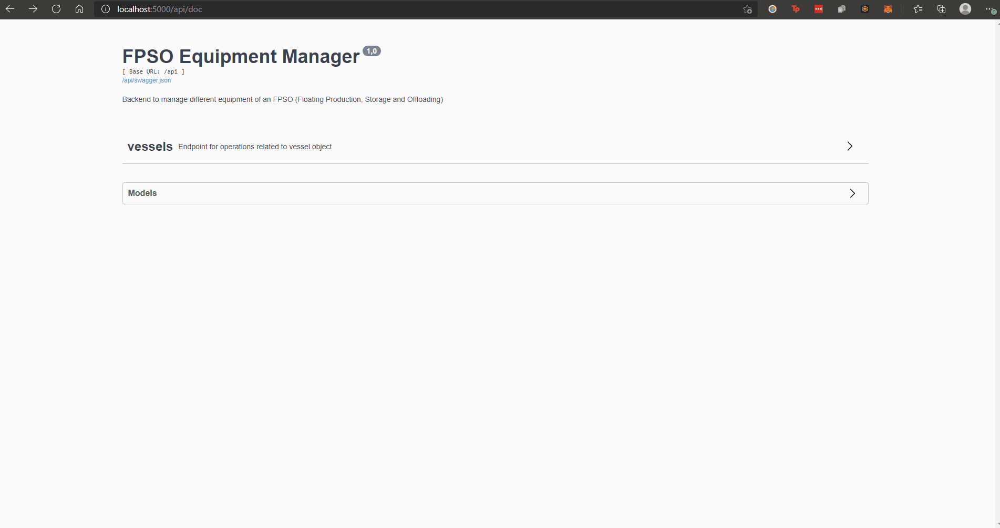
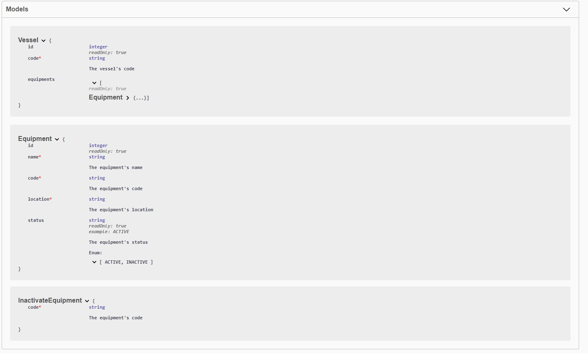

# FPSOEquipmentManager 

Backend to manage different equipment of an FPSO (Floating Production, Storage and Offloading)

<!-- TABLE OF CONTENTS -->
<details open="open">
  <summary>Table of Contents</summary>
  <ol>
    <li>
      <a href="#about-the-project">About The Project</a>
      <ul>
        <li><a href="#built-with">Built With</a></li>
      </ul>
    </li>
    <li>
      <a href="#set-up">Set Up</a>
      <ul>
        <li><a href="#prerequisites">Prerequisites</a></li>
        <li><a href="#installation">Installation</a></li>
      </ul>
    </li>
    <li><a href="#usage">Usage</a></li>
      <ul>
        <li><a href="#runtheapplication">Run the application</a></li>
        <li><a href="#testtheapplication">Test the application</a></li>
        <li><a href="#apiresources">API Resources</a></li>
      </ul>
    <li><a href="#contact">Contact</a></li>
  </ol>
</details>

<!-- ABOUT THE PROJECT -->
## About The Project

### Built With
* [Flask](https://palletsprojects.com/p/flask/) - Micro web framework.
* [flask-restx](https://github.com/python-restx/flask-restx) - Adds decorators to describe the 
  API and expose its documentation properly using *Swagger*. 
* [marshmallow](https://marshmallow.readthedocs.io/en/stable/) - Creates schemas for *validation* and *serialize/deserialize* data.
* [SQLAlchemy](https://www.sqlalchemy.org/) - ORM (Object Relational mapper) for database access.
* [SQLite](https://sqlite.org/index.html) - Data persistence and in memory database for unit tests.
* [Github Actions](https://github.com/ThiagoKoster/FPSOEquipmentManager/actions) - Created a workflow to execute automate
  tests when a Pull Request is done


<!-- SET UP -->
## Set up
### Prerequisites
Python 3

### Installation
1. Clone the repository:
    ```sh
    git clone https://github.com/ThiagoKoster/FPSOEquipmentManager
    ```
2. Setup virtual environment:
    ```sh
    python -m venv venv
    .\venv\Scripts\activate
    pip install -r requirements.txt
    ```

<!-- USAGE -->
## Usage
### Run the application
```sh
 python app.py
```
This will start the application at <http://localhost:5000/api/v1>

### Test the application
It's possible to do all requests with swagger!

- The swagger doc can be accessed at <http://localhost:5000/api/v1/doc> when the application is running.


- All models can be seen at the "Models" section.

   

### API Resources
* [POST /vessels](#post-vessel) 
* [GET /vessels](#get-vessels)
* [POST /vessels/[id]/equipments](#post-vesselequipment)
* [PATCH /vessels/[id]/equipments](#inactivate-vesselequipment)
* [GET /vessels/[id]/equipments](#get-vesselequipment)

#### POST /vessels
Registers a new vessel with an unique code in the database

Example: POST http://localhost:5000/api/v1/vessels

Request body:
```json
{
    "code": "BR-RJ002"
}
```
Response: 201 CREATED
```json
{
    "id": 2,
    "code": "BR-RJ002",
    "equipments": []
}
```
    

#### GET /vessels
Returns all vessels in the database

Example: GET http://localhost:5000/api/v1/vessels


Response: 200 OK
```json
[
    {
        "id": 1,
        "code": "BR-RJ001",
        "equipments": []
    },
    {
        "id": 2,
        "code": "BR-RJ002",
        "equipments": [
            {
                "id": 1,
                "name": "GPS",
                "code": "GPS001",
                "location": "Brazil",
                "status": "ACTIVE"
            },
            {
                "id": 2,
                "name": "GPS",
                "code": "GPS002",
                "location": "Brazil",
                "status": "ACTIVE"
            }
        ]
    }
]
```

#### POST /vessels/[id]/equipments

Registers new equipment for the vessel

Example: POST http://localhost:5000/api/v1/vessels/2/equipments

Request body:
```json
[
    {
    "name": "GPS",
    "code": "GPS001",
    "location": "Brazil"
    },
    {
    "name": "GPS",
    "code": "GPS002",
    "location": "Brazil"
    }
]
```
Response: 201 CREATED
```json
[
    {
        "id": 1,
        "name": "GPS",
        "code": "GPS001",
        "location": "Brazil",
        "status": "ACTIVE"
    },
    {
        "id": 2,
        "name": "GPS",
        "code": "GPS002",
        "location": "Brazil",
        "status": "ACTIVE"
    }
]
```

#### PATCH /vessels/[id]/equipments
Inactivate equipments of the vessel

Example: PATCH http://localhost:5000/api/v1/vessels/2/equipments

Request body:
```json
[
  {
    "code": "GPS001"
  }
]
```
Response: 204 No Content
#### GET /vessels/[id]/equipments
Get all equipments of the vessel, can be filtered by status

- Return all *ACTIVE* equipments:
  - GET http://localhost:5000/api/v1/vessels/2/equipments?status=ACTIVE

    Response: 200 OK
    ```json
    [
        {
            "id": 2,
            "name": "GPS",
            "code": "GPS002",
            "location": "Brazil",
            "status": "ACTIVE"
        }
    ]
    ```
- Return all equipments of the vessel:
  - GET http://localhost:5000/api/v1/vessels/2/equipments
    ```json
    [
        {
            "id": 1,
            "name": "GPS",
            "code": "GPS001",
            "location": "Brazil",
            "status": "INACTIVE"
        },
        {
            "id": 2,
            "name": "GPS",
            "code": "GPS002",
            "location": "Brazil",
            "status": "ACTIVE"
        }
    ]
    ```


<!-- CONTACT -->
## Contact
Thiago Koster Lago - thiagokoster@gmail.com


